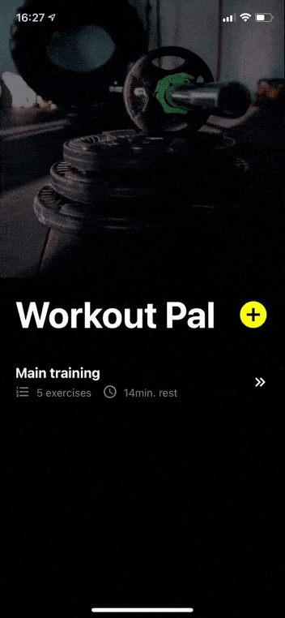

<center></center>
<h1><center>WORKOUT PAL</center></h1>

Workout Pal is an app that guides you during your training. You can easily :

- create your training
- configure rest time between each exercises
- create exercice
- set number of series and rest time between them

When it's time to train, Workout Pal will show you which exercice do, countdown your rest and how much series remains.

---

<center></center>

---

## :iphone: Try it on Expo

This app is bootstrapped with [Expo](https://expo.io), you can download the Expo app on the [App Store](https://itunes.apple.com/fr/app/expo-client/id982107779), and enter the url or scan the QR code provided below

| URL                                                         | QRCODE                   |
| ----------------------------------------------------------- | ------------------------ |
| [Install](https://expo.io/@thonythony/projects/workout-pal) |  |

## :computer: Build it yourself

Run the following commands:

```bash
# Install Expo cli
npm i -g expo-cli

# Clone this repo
git clone https://github.com/thonythony/workout-pal && cd workout-pal

# Install dependencies
npm install

# Run the app with Expo
npm start
```

The [Expo](https://expo.io) packager will show, and you can either:

- install the Expo app, scan the displayed QR code, and run the app on your mobile phone directly.
- open the Android simulator.
- open the iOS simulator.

## :raising_hand: Contribute

Workout Pal is a personal side project that respond to my needs about workout and used to discover [Expo](https://expo.io) and [React-Native](https://reactnative.dev/) world.

Probably some bugs are present and bad practices are used. So feel free to contribute by opening a pull request.

A feature is missing, feel free to talk by opening an issue.
